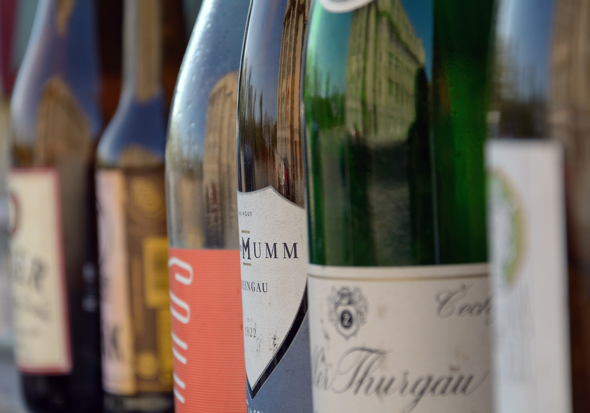

WineEnthusiast compiles comprehensive reviews of most wines and includes information such as country/region of origin, variety, and reviewer descriptions. This notebook will explore the data to answer three questions to help answer the larger question: Is it possible for wineries to use this data to help them price their wines?

The three questions we will focus on:

1. What are the origins and varieties of wine with the highest pricing?
2. What reviewer descriptors are linked to the highest priced wines?
3. Can we create a model that predicts an optimal price?

## What are the origins and varieties of wine with the highest pricing?

A winery wants to maximize the price the market will support for a given wine. Knowing what the competition in your area is charging might help understand this. What origins produce the highest priced wines? What wine varieties are the most expensive?

The following chart shoes the median wine price broken down by country.


Now let's look at the top prices by wine variety.


We can also further break down the origin of the wine by looking at the province and region of the winery.


Are certain countries producing more of one type of wine that might skew the results? Let's normalize for variety.


Are certain varieties only grown in certain countries thus skewing the results? Let's normalize for country.


The graphs above clearly show there is a large variance between countries, varieties, and regions. The US and Canada have the highest priced wines, while Spain and Argentina have the lowest. Picolit and Nebbiolo are the highest priced varieties, while Chenin Blanc-Viognier and White Riesling are the lowest.

This data obviously ignores variables like cost to develop, taxes, etc that might affect the price and profit. Our intent is only to show how the data present in WineEnthusiast might help a winery set their initial pricing range.

## What reviewer descriptors are linked to the highest priced wines?

The WineEnthusiast data includes text reviews for each wine by an expert reviewer. Do these experts use common words to describe higher or lower priced wines? Could a winery hire a reviewer and use the review to help price the wine?


The chart above illustrates the words that are commonly found in high and low priced wines. In the next section we will determine if this data can be used in our model.

## Can we create a model that predicts an optimal price?

We've seen charts above that show different features of high and low priced wine. Can we use these features to create a model that might predict a target price for a new wine? The next sections will explore this question.

For this task we filter out any outliers to make the model more accurate.

```
Unique country values before filtering: 43
Unique country values after filtering: 21
Unique province values before filtering: 357
Unique province values after filtering: 175
Unique region values before filtering: 1150
Unique region values after filtering: 565
Unique variety values before filtering: 466
Unique variety values after filtering: 223
```

For the review descriptions, we create a matrix of [TF-IDF](https://en.wikipedia.org/wiki/Tf%E2%80%93idf) features and only use the top 100 terms by frequency.

In the end our model has 945 total features.

Our training set has 56376 samples.<br/>
Our testing set has 27768 samples.

We are using a [Logistic Regression](https://en.wikipedia.org/wiki/Logistic_regression) model with the following parameters:

```
Iterations: 100
Inverse of regularization strength: 1
Solver: saga
Penalization: l1
```

After training, the [mean squared error](https://en.wikipedia.org/wiki/Mean_squared_error) on testing data was 177.7639. This equates to an error of 13.33. This is not ideal when the average bottle of wine is around $25. This model would not be accurate enough to properly predict the price. In future analysis, we could explore other classifier types to improve the results.

It appears the WineEnthusiast data might not be ideal for predicting price.
